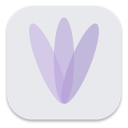
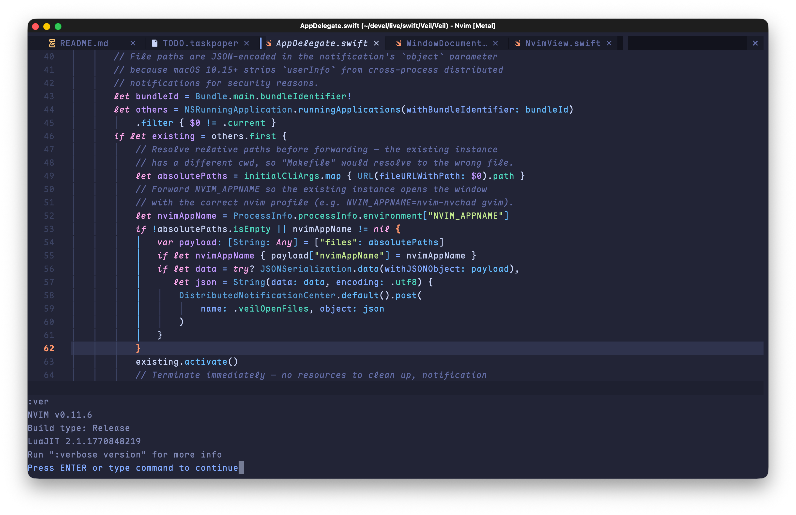

# Veil

<p align="center">
  
</p>

A quiet, vanilla Neovim GUI for macOS — in the tradition of MacVim.

Your Neovim config, in proper macOS windows. Instant startup with near-zero overhead, fast Metal rendering, fast multi-tab session loading. Designed for focus. No visual noise, no distractions.

### Why another Neovim GUI?

Veil brings the MacVim workflow to Neovim: multiple independent windows in a single app, Cmd+\` to switch between projects, Cmd+1/2/3 to jump to tabs. As a native macOS app instead of a terminal process, nearly all key sequences reach Neovim without being intercepted.

Vim is a tool built for focused, efficient work. Animations consume attention. Cursor effects, scroll easing, transition flourishes all pull your eyes away from what really matters — the text. Veil chooses to keep things quiet.

## Features

- **Multi-window**: each window runs an independent Neovim process. Cmd+N to create, Cmd+\` to cycle.
- **Tabs**: Neovim's native tabline, switchable with Cmd+1 through Cmd+9. Optional native macOS tab bar via `native_tabs` config.
- **Profile support**: Cmd+Shift+N to choose a different `NVIM_APPNAME` per window.
- **Remote nvim**: connect to a remote Neovim instance over TCP. Clipboard integrates seamlessly with your local Mac.
- **Font ligatures**: supported out of the box with ligature-capable fonts. Can be disabled via config.
- **CJK & IME**: full input method support for Chinese, Japanese, Korean.
- **Metal rendering**: heavily optimized GPU-accelerated rendering with custom-drawn box-drawing and block element characters for pixel-perfect lines. Falls back to CoreText if Metal is unavailable.
- **System integration**: standard Edit/File menu actions, trackpad scrolling, window size persistence.

<p align="center">
  
</p>

## Requirements

- macOS 14+
- Neovim 0.10+ recommended (install via `brew install neovim`)

Veil uses your system-installed Neovim. No bundled binary, under 1 MB download. Veil finds nvim anywhere your interactive shell can access it, and caches the resolved path so only the first launch pays the detection cost.

Veil communicates with Neovim via its stable msgpack-RPC and `ext_linegrid` UI protocol, and works with any recent Neovim version. The RPC layer is heavily optimized with event batching for responsive rendering.

## Install

### Homebrew

```bash
brew tap rainux/veil
brew install --cask veil
```

This installs `Veil.app` to `/Applications` and symlinks the `veil`, `gvim`, and `gvimdiff` CLI commands to your Homebrew bin directory.

### Manual

Download `Veil.zip` from [Releases](https://github.com/rainux/Veil/releases), unzip, and move `Veil.app` to `/Applications`. Then remove the quarantine attribute so macOS doesn't block it:

```bash
xattr -cr /Applications/Veil.app
```

## Build

Open `Veil.xcodeproj` in Xcode and run, or:

```
make                # Release build
make debug          # Debug build
make test           # Run unit tests
make install        # Release build + install to /Applications
make clean          # Clean build artifacts
make lsp            # Generate buildServer.json for SourceKit-LSP
```

For Neovim/editor LSP support, run `make lsp` after cloning to generate `buildServer.json` (requires [xcode-build-server](https://github.com/nicklockwood/xcode-build-server)).

## Usage

Veil reads your existing Neovim configuration (`~/.config/nvim/`). We recommend [Maple Mono](https://github.com/subframe7536/maple-font) for its excellent CJK support and Nerd Font icons:

```bash
brew install font-maple-mono-nf-cn    # or font-maple-mono-nf without CJK
```

```lua
vim.o.guifont = 'Maple Mono NF CN:h16'
```

Setting a [Nerd Font](https://www.nerdfonts.com/) as your `guifont` is the most reliable way to get statusline icons and devicons working. If you don't, Veil will automatically search for any installed Nerd Font on your system and use it as a fallback for icon glyphs, similar to how terminals like WezTerm and Kitty handle font fallback.

### Keyboard

These Cmd+key shortcuts are handled by Veil:

| Key              | Action                                |
| ---------------- | ------------------------------------- |
| Cmd+N            | New window                            |
| Cmd+Shift+N      | New window with profile picker        |
| Cmd+W            | Close tab (or window if only one tab) |
| Cmd+Shift+W      | Close window                          |
| Cmd+Q            | Quit                                  |
| Cmd+S            | Save (`:w`)                           |
| Cmd+Z            | Undo (`u`)                            |
| Cmd+Shift+Z      | Redo (`Ctrl+R`)                       |
| Cmd+C/X/V        | Copy/Cut/Paste (system clipboard)     |
| Cmd+A            | Select all                            |
| Cmd+M            | Minimize                              |
| Cmd+\`           | Cycle windows                         |
| Cmd+1-9          | Switch tab (9 = last)                 |
| Cmd+Ctrl+Shift+N | Connect to remote nvim                |
| Cmd+Ctrl+F       | Toggle full screen                    |

Everything else (including other Cmd+key and all Ctrl+key combinations) is sent directly to Neovim as `<D-...>` or `<C-...>`. Map them in your config:

```lua
-- Example: Cmd+P to open a file picker
vim.keymap.set('n', '<D-p>', Snacks.picker.files)
```

### Configuration

Veil reads settings from `~/.config/veil/veil.toml`. All fields are optional and have sensible defaults. See [`veil.sample.toml`](veil.sample.toml) for the full reference. Changes take effect on the next new window.

### Remote Neovim

Veil can connect to a Neovim instance running on a remote machine over TCP. Start Neovim on the remote host listening on localhost:

```bash
nvim --headless --listen 127.0.0.1:6666
```

Neovim's RPC protocol has no authentication, so always bind to `127.0.0.1` and use SSH tunneling. Never expose the listening port to the network directly.

Forward the port over SSH, then connect from Veil using Cmd+Ctrl+Shift+N:

```bash
# -L local_port:remote_host:remote_port
ssh -L 6666:127.0.0.1:6666 your-server
```

For a persistent setup, add to `~/.ssh/config`:

```properties
Host dev-nvim
    HostName your-server
    # local_port remote_host:remote_port
    LocalForward 6666 127.0.0.1:6666
```

Then `ssh dev-nvim` automatically forwards the port. Use `ssh -N dev-nvim` to forward without opening a shell.

You can save frequently used connections in `veil.toml`:

```toml
[[remote]]
name = "Dev Server"
address = "127.0.0.1:6666"

[[remote]]
name = "Staging"
address = "127.0.0.1:6667"
```

> ~~_I don't always code, but when I do, I code in production._~~

Clipboard integrates seamlessly with your local Mac. Yank/paste with `+` and `*` registers in the remote session operates on your local pasteboard.

### Debug

Veil registers two commands in Neovim for rendering diagnostics:

- `:VeilAppDebugToggle` — show/hide an overlay with renderer info, frame time, grid size, font details, and more
- `:VeilAppDebugCopy` — copy the same info to the system clipboard

## CLI

Veil ships CLI commands inside the app bundle: `veil`, plus `gvim` and `gvimdiff` as traditional aliases (`gvimdiff` is equivalent to `veil -d`). Symlink them to your PATH:

```bash
ln -s /Applications/Veil.app/Contents/bin/veil ~/.local/bin/veil
ln -s /Applications/Veil.app/Contents/bin/gvim ~/.local/bin/gvim
ln -s /Applications/Veil.app/Contents/bin/gvimdiff ~/.local/bin/gvimdiff
```

Then use it like nvim. All nvim flags and arguments are passed through transparently:

```bash
veil file.txt
gvim +42 file.txt               # open at line 42
gvim -p file1.txt file2.txt     # open in tabs
veil -d file1.txt file2.txt     # diff mode
gvimdiff file1.txt file2.txt    # same as veil -d
```

If Veil is already running, the CLI forwards arguments to the existing instance (opens a new window) instead of launching a second copy.

### Multiple nvim configs

Each window can run a different Neovim configuration. Use `NVIM_APPNAME` from the CLI or Cmd+Shift+N from the GUI to select which config directory under `~/.config/` nvim uses:

```bash
NVIM_APPNAME=astronvim veil              # launch Veil with astronvim config
NVIM_APPNAME=nvim-nvchad gvim file.txt   # open file with NvChad config
```

Create shell aliases for configs you use often:

```bash
alias gvi='NVIM_APPNAME=nvim-nvchad gvim'
gvi file.txt                             # just works, fresh launch or new window
```

## Background

MacVim introduced a workflow that set it apart from gVim: multiple independent windows in a single app, each with its own tabs, switching between projects instantly with Cmd+\`. You could have three codebases open, Cmd+\` between them, and Cmd+1/2/3 to jump to specific tabs within each one.

In the Neovim era, most GUI frontends followed the gVim model: you can open multiple instances, but each is a separate process with no way to Cmd+\` between them. VimR was the exception, bringing the MacVim multi-window experience to Neovim, but its Redux architecture made startup and multi-tab session loading noticeably slow.

Veil carries this tradition forward: a minimal, fast wrapper that gives Neovim first-class macOS citizenship. Multiple windows as independent workspaces, intuitive tab switching with Cmd+1/2/3, and as a native app instead of a terminal process, nearly all key sequences reach Neovim without being intercepted.

> **Note:** Neovide v0.16.0 also shipped macOS multi-window support within one day of Veil's first release, a fun coincidence. Neovide is an excellent choice if you prefer a cross-platform solution with visual effects. Veil focuses on being a minimal native macOS wrapper (under 1 MB).

## Acknowledgments

Thanks to [VimR](https://github.com/qvacua/vimr) by Tae Won Ha. Veil learned a great deal from its implementation of the Neovim UI protocol, input handling, and macOS integration.

Box-drawing and block element rendering algorithms are ported from [Ghostty](https://github.com/ghostty-org/ghostty) (MIT License).

Glyph overflow strategy inspired by [WezTerm](https://github.com/wez/wezterm): when a glyph (e.g. Nerd Font icon) is wider than its allocated cell, Veil renders it at full natural width if followed by a space, or shrinks it to fit otherwise.

## License

MIT
